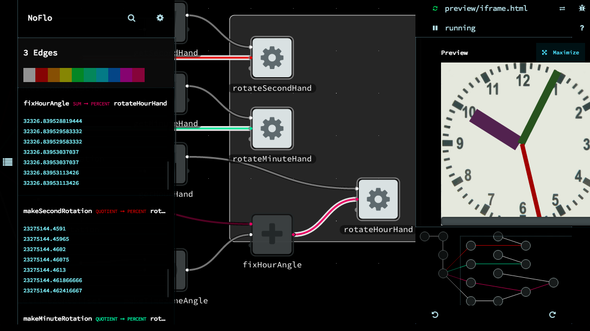

We're excited to launch the IDE for flow-based programming at [flowhub.io](http://flowhub.io/) this year. 

If you're interested in trying the new UI, take a look at the [getting started guide](http://flowhub.io/documentation/getting-started-browser/). 

  * Submit bugs to the [issue tracker](https://github.com/noflo/noflo-ui/issues) 
  * Send feedback to [forrest@thegrid.io](mailto:forrest@thegrid.io?subject=flowhub-ide)

If you're *really* brave and would like to run it on your own machine, see the build instructions on the [noflo-ui Github repository](https://github.com/noflo/noflo-ui).
